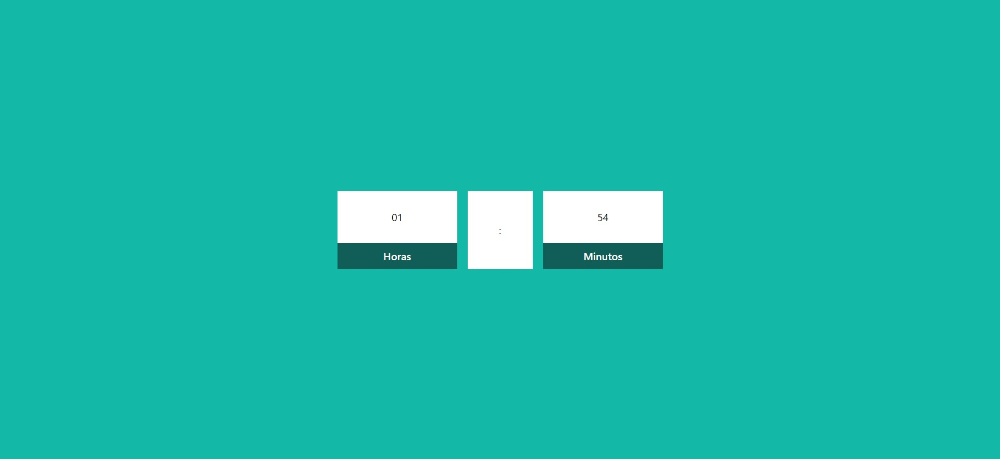

# Current Time 
 

A digital watch created with tailwindCss and javascript to learn more about this language that I love.

[preview website](https://ericodesenvolvedor.github.io/current-time/)

### Stack ⚙️ 

- HTML 
- CSS
- Figma
- TailwindCss

### Responsive 📱 

- Resposive layout.

Created with :heart: by 
  <a href="https://github.com/Ericodesenvolvedor">ericodesenvolvedor</a>

 
